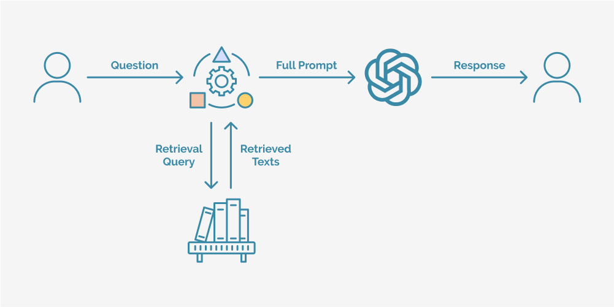

# Retrieval Augmented Generation

Retrieval-Augmented Generation (RAG) is a approach that combines two techniques in natural language processing (NLP): retrieval-based methods and generative models. The idea behind RAG is to enhance the generative capabilities of a model (like GPT or Llama) by augmenting it with a retrieval mechanism, which can fetch relevant external information to improve its response generation.

RAG incorporates retrieval into the generative process, making it a retrieval-augmented model. It can generate text based on both its own pre-trained knowledge (from a generative model) and external knowledge sources (from a retrieval model).

The RAG architecture was introduced by Facebook AI (Meta) and has two key components:

* **Retriever**: A component that retrieves relevant documents or passages from an external knowledge base or corpus. Usually, we store our documents into a vector database, so that the user query can be easily embedded and used to search for relevant passages in the database.
* **Generator**: A generative transformer-based model like GPT that generates a response by conditioning on the retrieved documents.

RAG addresses, or at least mitigates, the problem of factual accuracy and reliable source use. RAG applications are and will increasingly be relevant in the Humanities, GLAM, and documentary fields.

## How Does RAG Work?

*[Source](https://www.trantorinc.com/blog/what-is-rag-retrieval-augmented-generation).*

Steps of the RAG Process:

1.	**Query Encoding**: The input query (e.g., a question) is encoded into a vector using a pre-trained encoder.
2.	**Retrieval**: This encoded query is passed to the retriever, which searches a vector database or a large external corpus (such as Wikipedia) to find the top-k relevant documents or passages.
3.	**Augmenting with Retrieval**: The top-k retrieved documents are then combined with the original query. The generative model uses these documents as additional context to generate a final answer or response.
4.	**Generation**: The generative model, which conditions on both the input and the retrieved passages, generates a response that is informed by both the model’s knowledge and the retrieved information.

The main use cases for RAG include question-answering on specific collections of documents or information sources, fact checking, specialized conversational agents, and document summarization.

## Challenges of RAG

* Retrieval quality: The effectiveness of RAG depends heavily on the quality of the retrieved documents. If the retriever fails to fetch relevant documents, the generated response might be inaccurate.
* Retrieval speed: Searching through large external corpora can be computationally expensive and slow, especially if the corpus is very large. Efficient retrieval methods, such as DPR (Dense Passage Retrieval), are crucial to maintaining reasonable response times.
* Fusion of retrieved information: Integrating multiple retrieved documents into the generative process can be complex, and the model must decide how to weigh or combine the information from each retrieved passage.

## A RAG application to read papers

In this example, we use **chainlit** and **llama-index** to implement a simple RAG application to chat with a selection of papers. We use the reading list of the course as the set of document to provide the LLM, and the OpenAI GPT-4o model.

## Exercise

Develop your own RAG application. Consider the following:

1. Individuate your documents of interest and use the app on them.
2. Add metadata to the documents to facilitate their usage by the LLM, and experiment with prompting.
3. Add customizations to the interface, such as the possibility to upload a new file, and to tweak the LLM's parameters.
4. Change the vector database and seek something more performing.
5. Try and compare different LLMs, including locally using [Ollama](https://ollama.com/).
